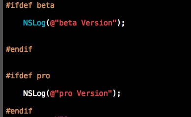

iOS Development Notes
============
记录在iOS8开发中遇到的一些问题,详见[issues](https://github.com/tasselx/iOS8Dev_Note/issues)

* [多个Targe开发](#多Targe开发)
* [隐藏部分TableViewCell分割线](#隐藏部分TableViewCell分割线)
  
  

##多个Targe开发

1. Enable Foundation Assertions 设置YES
2. Preprocessor Macros 设置编译条件 beta,pro

##隐藏部分TableViewCell分割线
[Demo](https://github.com/tasselx/iOS-Development-Notes/tree/master/Projects/HideSperatorLine)
